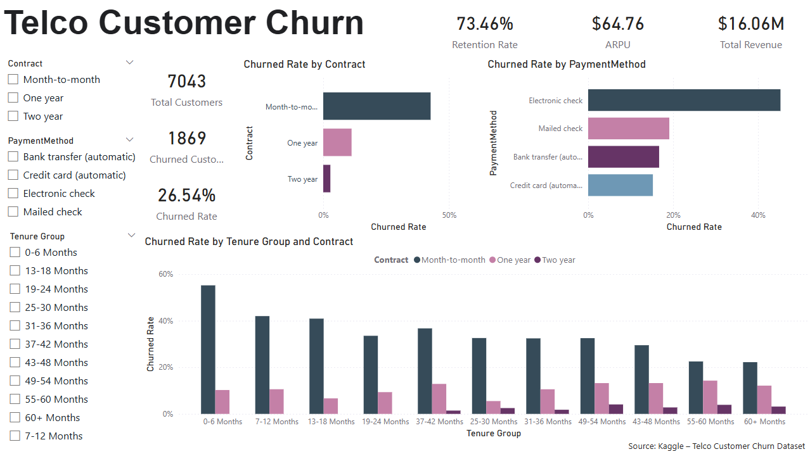

# Telco Customer Churn Analysis

Customer churn analysis using Power BI to identify key drivers and retention strategies in the telecom industry.


## Overview

Customer churn is a critical challenge in the telecommunications industry, directly impacting revenue and business sustainability.
This project analyzes customer behavior to uncover key factors influencing churn and provides actionable business insights.


## Business Objective

* Identify key drivers of customer churn
* Understand high-risk customer segments
* Provide recommendations to improve retention


## Dataset

- Source: Kaggle (Telco Customer Churn Dataset)  
- Original dataset file: WA_Fn-UseC_-Telco-Customer-Churn.csv  
- Link: https://www.kaggle.com/datasets/blastchar/telco-customer-churn  

> This dataset is publicly available and used for educational and portfolio purposes.


## Tools Used

* Power BI
* Microsoft Excel / CSV


## Dashboard Preview




## Key Insights

### 1. Contract Type Drives Churn

Customers with **month-to-month contracts** have the highest churn rate, indicating low commitment levels.

### 2. Payment Method Impacts Retention

Customers using **electronic check** show higher churn compared to automatic payment methods.

### 3. Early Tenure is Critical

Customers in the **first 0–6 months** have the highest churn rate, suggesting onboarding issues.

### 4. Loyalty Increases Over Time

Churn decreases as tenure increases, indicating stronger retention among long-term users.

### 5. High-Risk Segment Identified

Customers with:

* Month-to-month contracts
* Short tenure (0–6 months)
* Electronic check payments
  are the most likely to churn.

### 6. Revenue Risk

A churn rate of **26.54%** indicates a significant potential loss in recurring revenue.


## Business Recommendations

* Encourage customers to switch to long-term contracts
* Promote automatic payment methods
* Improve onboarding experience for new customers
* Target high-risk segments with retention campaigns


## How to Use

1. Download the `.pbix` file
2. Open in Power BI Desktop
3. Use filters to explore customer segments


## Repository Structure

```
telco-customer-churn-analysis/
│
├── data/
│   └── telco_churn.csv
│
├── dashboard/
│   └── churn_dashboard.pbix
│
├── images/
│   └── dashboard_preview.png
│
├── README.md
└── LICENSE
```


## License

Dataset sourced from Kaggle (Telco Customer Churn dataset), 
used under Apache 2.0 License for educational and portfolio purposes.


## Acknowledgements

Thanks to Kaggle for providing the dataset.
